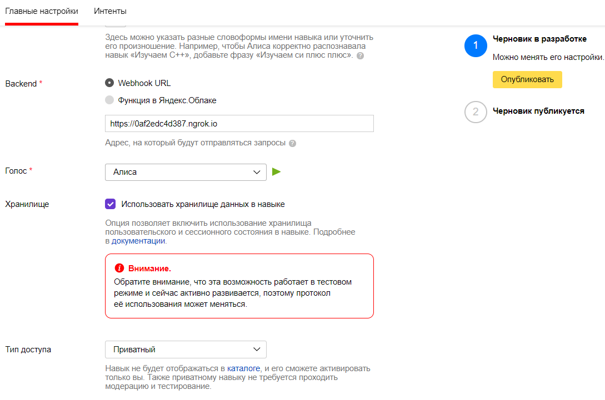
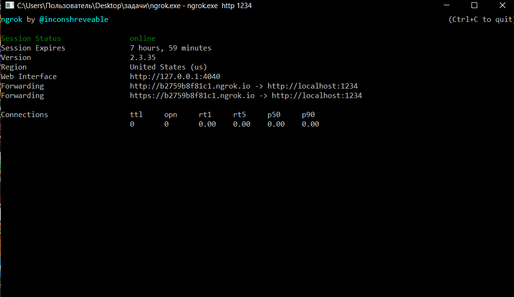
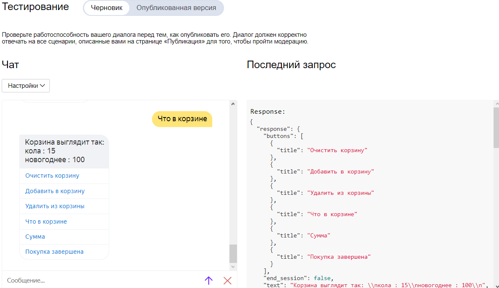
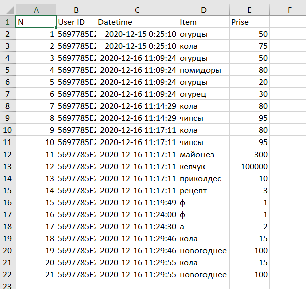

<p align="center">МИНИСТЕРСТВО НАУКИ  И ВЫСШЕГО ОБРАЗОВАНИЯ РОССИЙСКОЙ ФЕДЕРАЦИИ<br>
Федеральное государственное автономное образовательное учреждение высшего образования<br>
"КРЫМСКИЙ ФЕДЕРАЛЬНЫЙ УНИВЕРСИТЕТ им. В. И. ВЕРНАДСКОГО"<br>
ФИЗИКО-ТЕХНИЧЕСКИЙ ИНСТИТУТ<br>
Кафедра компьютерной инженерии и моделирования</p>
<br>
<h3 align="center">Отчёт по лабораторной работе № 2<br> по дисциплине "Программирование"</h3>
<br><br>
<p>студента 1 курса группы ПИ-б-о-202(1)<br>
Ясина Любомира Любомировича<br>
направления подготовки 09.03.04 "Программная инженерия"</p>
<br><br>
<table>
<tr><td>Научный руководитель<br> старший преподаватель кафедры<br> компьютерной инженерии и моделирования</td>
<td>(оценка)</td>
<td>Чабанов В.В.</td>
</tr>
</table>
<br><br>
<p align="center">Симферополь, 2020</p>
<hr>

## Цель:

1. Получить представления о структуре post-запроса;
2. Изучить webhooks как метод взаимодействия web-приложений;

## Постановка задачи
Разработать и зарегистрировать навык для Алисы на сервисе ЯндексюДиалоги;

В качестве backend-a для навыка реализовать приложение на языке С++ выполняющее следующие функции:

Составление продуктовой корзины:

Добавление продукта в корзину;
Удаление продукта из корзины;
Очистка корзины;
Вывод списка товаров в корзине;
Подсчёт стоимости товаров в корзине.
Вывод справочной информации по навыку;

Регистрацию webhook-ов сторонних сервисов;

Отправку данных на сторонние сервисы. 

В качестве стороннего сервиса реализовать приложение на языке Python выполняющее следующие функции:

Ожидание данных о покупке;
Сохранение поступивших данных в excel-документ.

## Выполнение работы
В ходе выполнения работы была пройдена регистрация в сервисе Яндекс, а после этого, был создан и настроен новый диалог, на сервисе Яндекс.диалоги (Рис. 1).



Рисунок 1 - настройка диалога

После написания приложений сервера и клиента была использованна программа ngrok для установки туннеля связи с сервером (Рис. 2).



Рисунок 2 - запущенная программа ngrok

После получения ссылки в программе ngrok, вставляем ее в соответствующую форму ввода настроек диалога.

Исходный код сервера:
```cpp

#include <iostream> 
#include <string> 
#include <vector> 
#include <fstream> 
#include <sstream> 
using namespace std; 

#include <cpp_httplib/httplib.h> 
using namespace httplib; 
#include <json/json.hpp> 
using json = nlohmann::json; 


Server server; 
const int SERVER_PORT = 1234;

string pwd; 

string template_webhook_single; 
string template_webhook_page; 

string config_path; 
string speech_path; 

json config; 

string file_pwd() {
	return ".";
}

string file_read(string abspath) {
	string res;
	ifstream file(abspath);
	if (file.good()) {
		res = string((istreambuf_iterator<char>(file)), istreambuf_iterator<char>());
		file.close();
		return res;
	}
	else {
		file.close();
		cout << "file_read Error: file ifstream is bad. (" << abspath << ")" << endl;
		throw "file_read Error: file ifstream is bad.";
	}
}
void file_write(string abspath, const string& data) {
	ofstream file;
	file.open(abspath);
	file << data;
	file.close();
}

json file_read_json(string abspath) {
	return json::parse(file_read(abspath));
}

void file_write_json(string abspath, json data) {
	file_write(abspath, data.dump());
}

bool file_exists(string abspath) {
	ifstream file(abspath);
	bool res = file.good();
	file.close();
	return res;
}

string replace_all(string str, const string& from, const string& to)
{
	size_t start_pos = 0;
	while ((start_pos = str.find(from, start_pos)) != string::npos)
	{
		str.replace(start_pos, from.length(), to);
		start_pos += to.length(); 
	}
	return str;
}

void config_write() {
	file_write_json(config_path, config);
}

void config_read() {
	config = file_read_json(config_path);
}

int hook_get_index(string url) {
	int i = 0;
	for (auto& hook : config["webhooks"]) {
		if (url == hook.get<string>()) return i;
		i++;
	}
	return -1; 
}

void hook_set(string url) {
	if (hook_get_index(url) == -1) {
		config["webhooks"].push_back(url);
		config_write();
	}
}

void hook_del(string url) {
	int index = hook_get_index(url);
	if (index != -1) {
		config["webhooks"].erase(index);
		config_write();
	}
}

string hook_page_get_html() {
	string webhooks_html = "";
	for (auto& hook : config["webhooks"]) {
		webhooks_html += replace_all(template_webhook_single, "{Webhook URL}", hook) + "\n";
	}
	string res_html = replace_all(template_webhook_page, "{webhooks_list}", webhooks_html);
	return res_html;
}


#include "post_root.cpp"
#include "post_webhooks.cpp"


int main(int argc, char** argv)
{
	try {
		pwd = file_pwd();

		template_webhook_page = file_read(pwd + "\\html\\webhook-page.html");
		template_webhook_single = file_read(pwd + "\\html\\webhook-single.html");

		config_path = pwd + "\\json\\config.json"; 
		if (!file_exists(config_path)) 
			file_write(config_path, R"({ "webhooks": [] })"); 
		config_read(); 

		server.Post("/", post_root_handler); 
		server.Post("/webhooks", post_webhooks_handler);

		cout << "Server served on localhost:" << SERVER_PORT << "\n";
		server.listen("localhost", SERVER_PORT);

		return 0;
	}
	catch (const char* e) {
		cout << e;
	}
}
```

Исходный код Python:
```python
from flask import Flask, request 
import openpyxl 
import os.path 
import datetime 

app = Flask(__name__)

STORAGE_LEN = 0 
storage = [] 

pwd = os.path.abspath(os.path.dirname(__file__))

@app.route('/', methods=['POST', 'GET'])
def index():
   global storage 
   if request.method == 'POST': 
      storage += [request.json]
      print('req.body:', storage[-1]) 
      if (len(storage) > STORAGE_LEN):
         save_excel() 
         storage = [] 
      return 'OK' 
      
   elif request.method == 'GET':
      return 'Это GET запрос'

# функция сохранения содержимого в эксель
def save_excel():
   global storage 
   
   STORAGE_FILE = os.path.join(pwd, 'data.xlsx') 
  
   book = None
   
   if not os.path.exists(STORAGE_FILE):
      book = openpyxl.Workbook() # создаем пустую книгу
      # добавляем в неё заголовки
      book.active['A1'] = 'N'
      book.active['B1'] = 'User ID'
      book.active['C1'] = 'Datetime'
      book.active['D1'] = 'Item'
      book.active['E1'] = 'Prise'
      book.save(STORAGE_FILE) 
   else: # если же существовал
      book = openpyxl.open(STORAGE_FILE) # то открываем его
   sheet = book.active # устанавливаем первый лист основным
   
   max_row = len(sheet['A']) 
   nowtime = datetime.datetime.now() # берём текущее время
   
   row = max_row + 1 
   for dataset in storage:
      id = dataset['user_id'] 
      check = dataset['check'] 
      
      for item in check: 
         # выводим информацию на лист
         sheet[row][0].value = row - 1
         sheet[row][1].value = id
         sheet[row][2].value = nowtime
         sheet[row][3].value = item['name']
         sheet[row][4].value = item['price']
         row += 1
   
   book.save(STORAGE_FILE) 
   book.close() 


if __name__ == '__main__':
   app.run()
```

Скриншот работы диалога показан на рисунке 3.



Рисунок 3 - работа диалога

Скриншот вывода информации в таблицу excel показан на рисунке 4.



Рисунок 4 - информация в Excel таблице
## Вывод по работе. 
Для достижения поставленной цели были выполнены все поставленные задачи, а именно:

	1) Изучены webhooks как метод взаимодействия web-приложений;
	2) Создано серверное приложение на языке программирования C++;
	3) Создано клиентское приложение на языке программирования Python.
