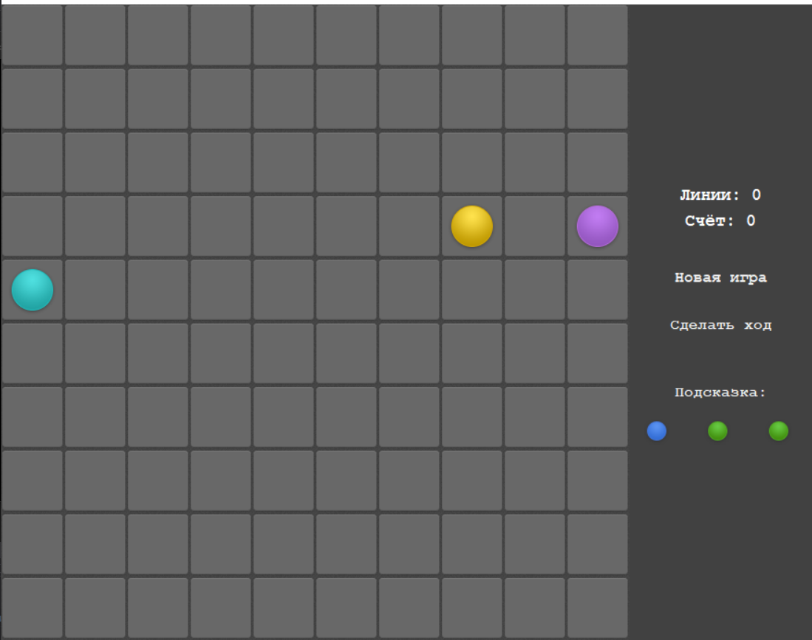
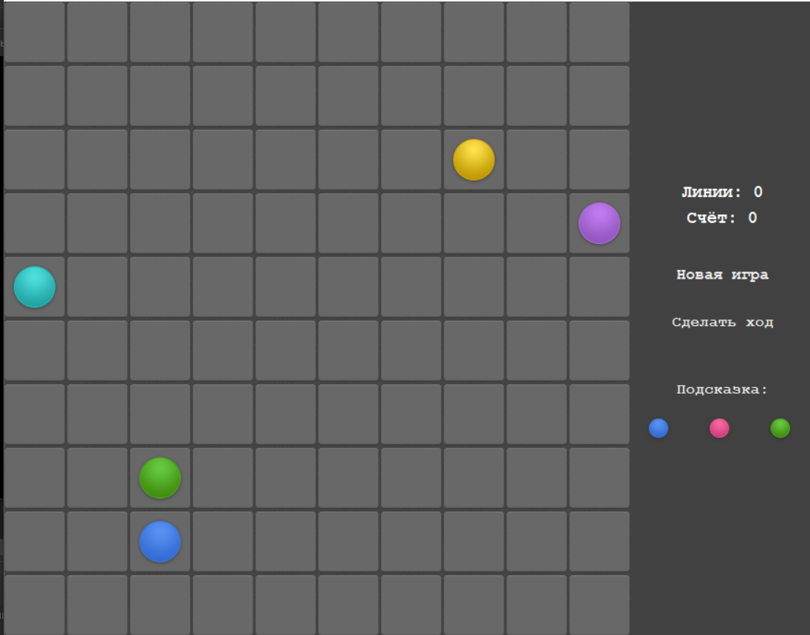
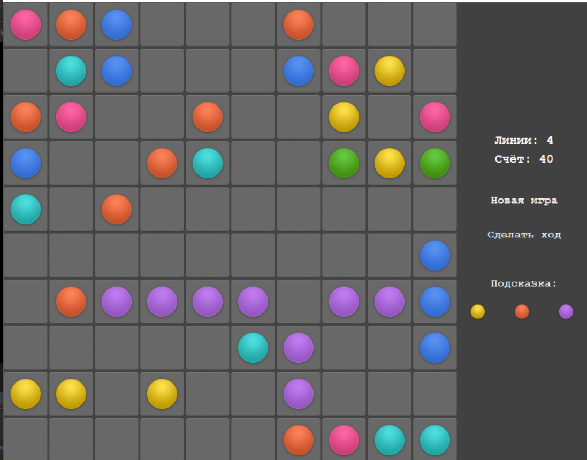
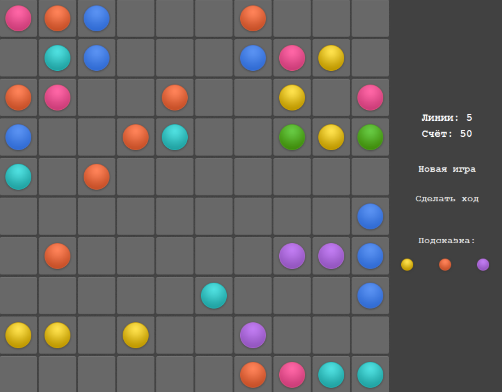
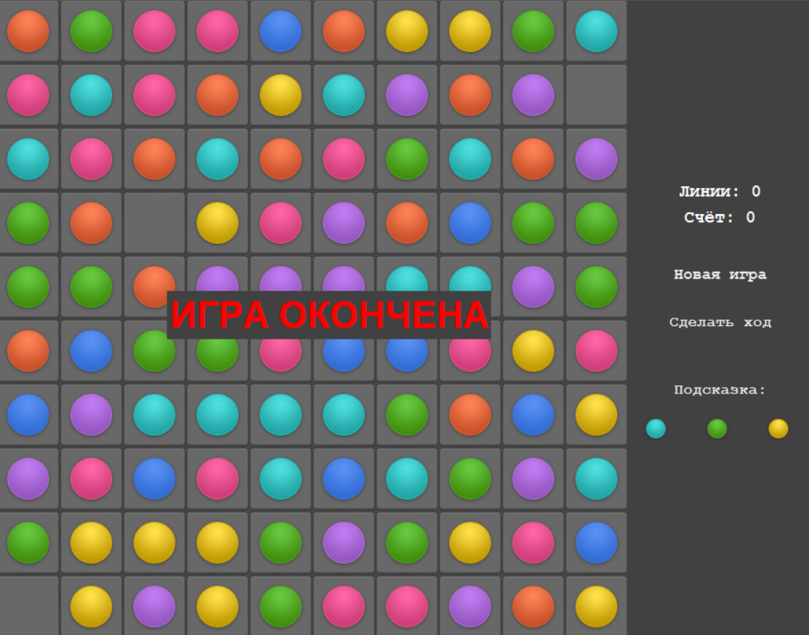

<p align="center">МИНИСТЕРСТВО НАУКИ  И ВЫСШЕГО ОБРАЗОВАНИЯ РОССИЙСКОЙ ФЕДЕРАЦИИ<br>
Федеральное государственное автономное образовательное учреждение высшего образования<br>
"КРЫМСКИЙ ФЕДЕРАЛЬНЫЙ УНИВЕРСИТЕТ им. В. И. ВЕРНАДСКОГО"<br>
ФИЗИКО-ТЕХНИЧЕСКИЙ ИНСТИТУТ<br>
Кафедра компьютерной инженерии и моделирования</p>
<br>
<h3 align="center">Отчёт по лабораторной работе № 3<br> по дисциплине "Программирование"</h3>
<br><br>
<p>студента 1 курса группы ПИ-б-о-202(1)<br>
Ясина Любомира Любомировича<br>
направления подготовки 09.03.04 "Программная инженерия"</p>
<br><br>
<table>
<tr><td>Научный руководитель<br> старший преподаватель кафедры<br> компьютерной инженерии и моделирования</td>
<td>(оценка)</td>
<td>Чабанов В.В.</td>
</tr>
</table>
<br><br>
<p align="center">Симферополь, 2020</p>
<hr>

## Цель:

1. Закрепить навыки разработки программ с простым графическим интерфейсом пользователя на зыке Python при помощи библиотеки Tkinter;
2. Получить представление о разработке простых игровых приложений.

## Постановка задачи
1. Используя стандартный модуль для разработки программ с графическим интерфейсом Tkinter реализуйте игру Lines на зыке Python.
2. В качестве образца графического интерфейса использовать игру-пример.

## Выполнение работы
В ходе выполнения работы была создана игра "Lines" (Рис. 1).



Рисунок 1 - Начало игры

После каждого хода на поле добавляются 3 новых шара (Рис. 2).



Рисунок 2 - добавление шаров после хода

При образовании ряда более 5 шаров, исчезают только первые 5 (Рис. 3-4)



Рисунок 3 - образование линии, включающей более 5 фиолетовых шаров 



Рисунок 4 - засчитывание только 5 фиолетовых шаров

При отсутствии свободных полей игра заканчивается (Рис. 5)



Рисунок 5 - Игра закончена


Исходный код приложения:
```Python
from tkinter import *
from PIL import Image, ImageTk
from os import path
from random import randint
 
class Model_Polya(list):
   def __init__(self, field: list):
      self.field = field
      
      size = len(field)
      
      def diagonal_kvadrat(square_shift_x, square_shift_y, square_size, reversed = False):
         nonlocal field
         diag = []
         for i in range(square_size): 
            if not reversed:
               zx = i
               zy = i
            else:
               zx = square_size - 1 - i
               zy = i
            diag.append(field[square_shift_y + zy][square_shift_x + zx])
            
         return diag
      
      rows = field
      
      cols = [[] for cell in field[0]]
      for row in field:
         i = 0
         for cell in row:
            cols[i].append(cell)
            i += 1
            
      glavnaya_diagonal = []
      glavnaya_diagonal.append(diagonal_kvadrat(0, 0, size))
      for i in range(5, size): 
         k = size - i
         glavnaya_diagonal.append(diagonal_kvadrat(k, 0, i))
         glavnaya_diagonal.append(diagonal_kvadrat(0, k, i))
      
      dopolnitelnaya_diagonal = []
      dopolnitelnaya_diagonal.append(diagonal_kvadrat(0, 0, size, True))
      for i in range(5, size): 
         k = size - i
         dopolnitelnaya_diagonal.append(diagonal_kvadrat(k, k, i, True))
         dopolnitelnaya_diagonal.append(diagonal_kvadrat(0, 0, i, True))
         
         
      self.rows = rows
      self.cols = cols
      self.glavnaya_diagonal = glavnaya_diagonal
      self.dopolnitelnaya_diagonal = dopolnitelnaya_diagonal
      


class Model:
   def __init__(self, view ): 
      self.view = view
      self.state = 'Шарик не выбран'
      self.selected = None
      self.score = 0
      self.lines = 0
      self.field = Model_Polya(view.field)
      
      self.restart()
      
      view.aside.controls.new_game.bind('<Button-1>', self.restart)
      view.aside.controls.step.bind('<Button-1>', self.step)
      
      for row in self.view.field:
         for cell in row:
            cell.on_click_handler = self._cell_click_handler
      
      
   def run_debug(self):
      
      if self._debug_has('md'):
         glavnaya_diagonal = self.field.glavnaya_diagonal
         
         for line, i in zip(glavnaya_diagonal, range(len(glavnaya_diagonal))):
            for cell in line:
               if cell.is_free:
                  cell.config(text=str(i), image='', width=7, height=4)
               else:
                  fg = None
                  if (cell.ball_tile == self.view.tiles.ball_aqua): fg='aqua'
                  if (cell.ball_tile == self.view.tiles.ball_blue): fg='blue'
                  if (cell.ball_tile == self.view.tiles.ball_red): fg='red'
                  if (cell.ball_tile == self.view.tiles.ball_pink): fg='pink'
                  if (cell.ball_tile == self.view.tiles.ball_yellow): fg='yellow'
                  if (cell.ball_tile == self.view.tiles.ball_violet): fg='violet'
                  if (cell.ball_tile == self.view.tiles.ball_green): fg='green'
                  cell.config(text=str(i), image='', width=7, height=4, foreground=fg)
      
   def restart(self, event = None):
      self.view.game_over_visibility = False
      self._clear_field()
      self.sozdan_podskazki()
      self.step()
      self.view.aside.info.update_score(0)
      self.view.aside.info.update_lines(0)
      self.state = 'шарик не выбран'
      
   def step(self, event = None):
      if self.state == 'игра окончена': return
      self.ispolz_podskazki()
      self.sozdan_podskazki()
      
      
   def sozdan_podskazki(self):
      balls = []
      for i in range(3):
         balls.append(self._random_ball())
      self.view.aside.podskazka.update(balls)
   
   def ispolz_podskazki(self):
      hint = self.view.aside.podskazka
      
      free = self._field_free_cells()
      print('free count:', len(free))
      
      for i in range(2, -1, -1):
         if len(free)-i <= 1: 
            self.state = 'завершение игры'
            self.game_over()
            return
         else:
            cell = self._random_from(free)
            cell.put_ball(hint.model[i])
            free.pop()
            
            
   def game_over(self):
      
      print('GAME OVER')
      self.view.game_over_visibility = True
      self.state = 'игра окончена'
            
            
   def _debug_has(self='1.0', value=END):
      return value in self.view.aside.info.get_debug().split(';')
   
   
   def _random_from(self, list_of):
      return list_of[randint(0, len(list_of)-1)]         
         
   def _random_ball(self):
      tiles = self.view.tiles
      balls = [
         tiles.ball_aqua,
         tiles.ball_blue,
         tiles.ball_green,
         tiles.ball_pink,
         tiles.ball_red,
         tiles.ball_violet,
         tiles.ball_yellow
      ]
      
      return self._random_from(balls)
   
         
   def _field_free_cells(self):
      free = []
      field = self.view.field
      for row in field:
         for cell in row:
            if cell.is_free:
               free.append(cell)
      return free
   
   def _clear_field(self):
      field = self.view.field
      
      for row in field:
         for cell in row:
            cell.clear()
   
      
   def _cell_click_handler(self, cell, event):
      self.run_debug()
      
      if cell.is_free:
         if self.state == 'шарик не выбран':
            pass
         elif self.state == 'шарик выбран':
            reachable = self._cells_reachable(self.selected, cell)
            
            if reachable: 
               cell.put_ball(self.selected.ball_tile)
               
               self.selected.unselect_ball()
               self.selected.clear()
               self.selected = None
               
               self.state = 'шарик перемещён'
               
               lines = self._check_all_lines()
               
               for line in lines:
                  self.lines += 1
                  self.view.aside.info.update_lines(self.lines)
                  
                  for cell in line:
                     cell.unselect_ball()
                     cell.clear()
                     
                     self.score += 2
                     self.view.aside.info.update_score(self.score)
                     
               self.state = 'шарик не выбран'
                 
               if len(lines) == 0:
                  self.step()
               
            else: 
               pass
      else:                
         if self.state == 'шарик не выбран':
            self.state = 'шарик выбран'
            self.selected = cell
            cell.select_ball()
         elif self.state == 'шарик выбран':
            self.selected.unselect_ball()
            self.selected = cell
            cell.select_ball()
            
   
   def _cells_reachable(self, a, b, print_check_way = False):
      def reset_cells_prev():
         field = self.view.field
         for row in field:
            for cell in row:
               cell.is_prev = False
      def step_all_directions(from_cell: Yacheika_prosm, target: Yacheika_prosm):
         steps = []
         left = Position(1,0)
         right = Position(-1,0)
         up = Position(0,1)
         down = Position(0,-1)
         for direction in [up, down, left, right]:
            print('direction:', direction.x, direction.y)
            sibling = from_cell.sibling_in(direction)
            if not sibling:
               continue
            if sibling == target:
               return True
            else:
               if sibling.is_free and not sibling.is_prev:
                  sibling.is_prev = True
                  if print_check_way:
                     sibling._blend_bg_ball(1, self.view.tiles.ball_yellow, 6)
                  steps.append(sibling)
                  print('> add step')
                  
               elif sibling.is_free and sibling.is_prev:
                  if print_check_way:
                     sibling._blend_bg_ball(1, self.view.tiles.ball_green, 6)
                  print('> is prev')
                  
               elif not sibling.is_free:
                  print('> is Ball')
                  
         return steps
      
      
      steps = [a]
      
      while True:
         print('steps count:', len(steps))
         new_steps_storage = []
         
         for step in steps:
            print('\nstep:', step.pos.x, step.pos.y)
            new_steps = step_all_directions(step, b)
            
            if new_steps is True: 
               print('FOUND')
               reset_cells_prev()
               return True
            else: 
               new_steps_storage += new_steps
         
         if len(new_steps_storage) == 0: 
            print('NO STEPS')
            reset_cells_prev
            return False
         steps = new_steps_storage
      
   def _check_all_lines(self):
      
      def check_lines(lines):
         sequences = []
      
         for line in lines:
            sequence = []
            prev_color = None
            
            def reset_sequence(color, cell = None):
               nonlocal sequence, prev_color
               
               if len(sequence) >= 5:
                  sequence = sequence[:5] #Делаем срез массива, чтобы считать только 5 элементов
                  sequences.append(sequence)
               
               prev_color = color
               sequence = [cell] if cell else []
               
            
            for cell in line:
               if cell.is_free:
                  reset_sequence(None)
                  continue
               
               else:
                  curr_color = cell.ball_tile
                  
                  if prev_color == None:
                     reset_sequence(curr_color, cell)
                     
                  elif curr_color == prev_color:
                     sequence.append(cell)
                  else: 
                     reset_sequence(curr_color, cell) 
            reset_sequence(None)
         return sequences
      lines = []
      lines += check_lines(self.field.rows)
      lines += check_lines(self.field.cols)
      lines += check_lines(self.field.glavnaya_diagonal)
      lines += check_lines(self.field.dopolnitelnaya_diagonal)
      
      return lines

class Position:
   def __init__(self, x: int, y: int):
      self.x = x
      self.y = y
   @staticmethod
   def differ(pos1, pos2):
      return Position(pos1.x-pos2.x, pos1.y-pos2.y)

class Tile:
   def __init__(self, name, size):
      img_folder = path.realpath(path.dirname(__file__) + '/../img')
      self._image_path = img_folder + f'/{name}.png'
      self.normal
      self.size = size
      
      self.taken = [None for i in range(10)]
      
   @property
   def rgba(self):
      self.image = Image.open(self._image_path).convert('RGBA')
      return self
   @property
   def normal(self):
      self.image = Image.open(self._image_path)
      return self
   
   def take(self, i):
      if not self.taken[i]:
         taken = self.cut(i)
         taken_photo = ImageTk.PhotoImage(taken)
         self.taken[i] = taken_photo
         return taken_photo

      else:
         return self.taken[i]
      
   def cut(self, i):
      step = self.size
      xs = 1; xe = self.size
      ys = (i-1) * step; ye = i * step
      taken = self.image.crop((xs, ys, xe, ye))
      
      return taken
      
class Vid_yacheiki():
   def __init__(self):
      self.ball_aqua = Tile('ball-aqua', 60)
      self.ball_blue = Tile('ball-blue', 60)
      self.ball_green = Tile('ball-green', 60)
      self.ball_pink = Tile('ball-pink', 60)
      self.ball_red = Tile('ball-red', 60)
      self.ball_violet = Tile('ball-violet', 60)
      self.ball_yellow = Tile('ball-yellow', 60)
      self.cell = Tile('cell-bgr', 69)
      self.page = Tile('page-bgr', 128)
            
tiles = None

class Yacheika_prosm(Label):
   def __init__(self, master, row, col, field):
      self.baked = None
      self.ball_tile = None
      self.field: list[list[Yacheika_prosm]] = field
      
      super().__init__(master, image=tiles.cell.take(1), borderwidth=0)
      self.grid(row=row, column=col)
      self.bind('<Button-1>', self.on_click)
      self.on_click_handler = None
      self.pos = Position(col, row)
      self.is_prev = False 
      
   def put_ball(self, ball_tile: Tile):
      self._blend_bg_ball(1, ball_tile, 1)
      
   def select_ball(self):
      self._blend_bg_ball(2, self.ball_tile, 1)
      
   def unselect_ball(self):
      self._blend_bg_ball(1, self.ball_tile, 1)
   
   def _blend_bg_ball(self, bg_tile_num, ball_tile, ball_tile_num):
      bg = tiles.cell.rgba.cut(bg_tile_num)
      ball = ball_tile.rgba.cut(ball_tile_num)
      ball_new = Image.new('RGBA', bg.size)
      ball_new.paste(ball, (7, 6))
      baked = Image.alpha_composite(bg, ball_new)
      baked_photo = ImageTk.PhotoImage(baked)
      self.baked = baked_photo
      self.ball_tile = ball_tile
      self.config(image=baked_photo)
      
   def clear(self):
      self.baked = None
      self.config(image=tiles.cell.take(1))
      
   def on_click(self, event):
      if (self.on_click_handler):
         self.on_click_handler(self, event)
         
   @property
   def is_free(self):
      return not self.baked

   def sibling_in(self, direction: Position):
      rev_dir = Position(-direction.x, -direction.y)
      new_pos = Position.differ(self.pos, rev_dir)
      if (new_pos.x < 0 or new_pos.y < 0 or 
          new_pos.y > len(self.field)-1 or new_pos.x > len(self.field[0])-1):
         return None
      return self.field[new_pos.y][new_pos.x]

class Inform_tablo():
   def __init__(self, master):
      self.lines = Label(master, bg='#414141', fg='#ffffff')
      self.lines.grid(row=1, column=1, columnspan=3)
      self.score = Label(master, bg='#414141', fg='#ffffff')
      self.score.grid(row=2, column=1, columnspan=3)
      self.update_lines(0)
      self.update_score(0)

      self.debug = Text(master)

   def update_lines(self, value):
      self.lines.config(text=f'Линии: {value}', font=("Courier", "14",'bold'))
      
   def update_score(self, value):
      self.score.config(text=f'Счёт: {value}', font=("Courier", "14",'bold'))
      
   def get_debug(self):
      return self.debug.get('1.0', END).strip()

class Knopki():
   def __init__(self, master):
      Label(master, height=1, background='#414141').grid(row=3, column=1, columnspan=3)
      
      self.new_game = Button(master, text="Новая игра", bg='#414141', fg='#eeeeee', padx=20, pady=10, relief='flat', width=15, font=("Courier", "13",'bold'))
      self.new_game.grid(row=5, column=1, columnspan=3)
      self.step = Button(master, text="Сделать ход", bg='#414141', fg='#eeeeee', padx=20, pady=10, relief='flat', width=15, font=("Courier", "12",'bold'))
      self.step.grid(row=6, column=1, columnspan=3)
      
class Podskazka(list):
   def __init__(self, master):
      super().__init__()
      Label(master, height=2, background='#414141').grid(row=7, column=1, columnspan=3)
      Label(master, text='Подсказка:', bg='#414141', fg='#eeeeee', font=("Courier", "12",'bold')).grid(row=8, column=1, columnspan=3)
      self.model = []
      for i in range(3):
         self.append(Label(master, bg='#414141'))
         self.model.append(None)
         self[i].grid(row=9, column=1+i)
         
   def update(self: list, three_balls: list):
      i = 0
      for ball in three_balls:
         self[i].config(image=ball.take(5))
         self.model[i] = ball
         i += 1

class Dop_functions():
   def __init__(self, master):
      master.config(bg='#414141')
      self.controls = Knopki(master)
      self.podskazka = Podskazka(master)
      self.info = Inform_tablo(master)

class View():
   def __init__(self, N):
      global tiles
      
      self.root = Tk()
      aside_width = 200
      width = 68 * N + aside_width
      height = 68 * N + 10
      self.size = Position(width, height)
      self.root.geometry(f'{width}x{height}')
      self.N = N
      tiles = Vid_yacheiki()

      self.tiles = tiles
      self.root.config(background='#414141')
      self.field_frame = Frame(self.root)
      self.field_frame.grid(row=1, column=1)
      self.aside_frame = Frame(self.root, width=aside_width)
      self.aside_frame.grid(row=1, column=2)
      self.aside = Dop_functions(self.aside_frame)
      
      self.field = []
      for row in range(N):
         self.field.append([])
         for col in range(N):
            cell = Yacheika_prosm(self.field_frame, row, col, self.field)
            self.field[row].append(cell)
            
      self.game_over = Label(self.field_frame, text="ИГРА ОКОНЧЕНА", fg='red', bg='#414141', font=('sans-serif', 30, 'bold'))
 
   @property
   def game_over_visibility(self):
      pass
      
   @game_over_visibility.setter
   def game_over_visibility(self, visible: bool):
      if visible:
         self.game_over.place(x=self.size.x/4.8, y=self.size.y/2.2)
      else:
         self.game_over.place_forget()

   def render(self):
      self.root.mainloop()

view = View(10) # Заданная размерность окна
model = Model(view)

view.render()

```

## Вывод по работе. 
Для достижения поставленной цели были выполнены все поставленные задачи, а именно:

	1) Закреплены навыки разработки программ с графическим интерфейсом Tkinter;
	2) Создано приложение с использованием графического интерфейса Tkinter
	
