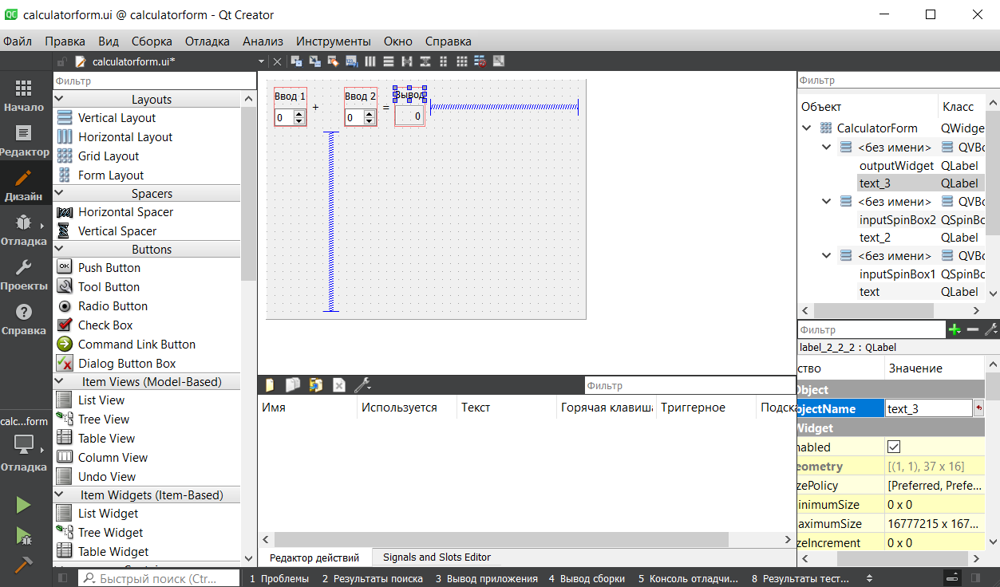

<p align="center">МИНИСТЕРСТВО НАУКИ  И ВЫСШЕГО ОБРАЗОВАНИЯ РОССИЙСКОЙ ФЕДЕРАЦИИ<br>
Федеральное государственное автономное образовательное учреждение высшего образования<br>
"КРЫМСКИЙ ФЕДЕРАЛЬНЫЙ УНИВЕРСИТЕТ им. В. И. ВЕРНАДСКОГО"<br>
ФИЗИКО-ТЕХНИЧЕСКИЙ ИНСТИТУТ<br>
Кафедра компьютерной инженерии и моделирования</p>
<br>
<h3 align="center">Отчёт по лабораторной работе № 3<br> по дисциплине "Программирование"</h3>
<br><br>
<p>студента 1 курса группы ПИ-б-о-202(1)<br>
Ясина Любомира Любомировича<br>
направления подготовки 09.03.04 "Программная инженерия"</p>
<br><br>
<table>
<tr><td>Научный руководитель<br> старший преподаватель кафедры<br> компьютерной инженерии и моделирования</td>
<td>(оценка)</td>
<td>Чабанов В.В.</td>
</tr>
</table>
<br><br>
<p align="center">Симферополь, 2021</p>
<hr>

## Цель:

1. Установить фреймворк Qt;
2. Изучить основные возможности создания и отладки программ в IDE Qt Creator.
## Постановка задачи
1. Настроить рабочее окружение, для разработки программного обеспечения при помощи Qt и IDE Qt Creator, а также изучить базовые возможности данного фреймворка.

## Выполнение работы

## Задание 1

В ходе выполнения работы был установлен и изучен фреймворк Qt. Для установки Qt была пройдена регистрация на официальном сайте, после чего был получен установочный файл.
После запуска установочного файла была выбрана и установлена последняя, не кастомная версия Qt (6.02). Правильность установки была проверена путем запуска проекта приведенного в готовых примерах, и изменениями в нем некоторых элементов.
На рисунке 1 показан запущеный проект, с изменениями согласно заданию.



Рисунок 1 - измененый шаблон проекта

## Задание 2

1. Как изменить цветовую схему (оформление) среды?
   Вкладка "инструменты" >> "параметры" >> "среда" >> "интерфейс", в которой необходимо выбрать цветовую схему.
2. Как закомментировать/раскомментировать блок кода средствами Qt Creator? Имеется ввиду комбинация клавиш или пункт меню.
	Комбинация клавиш "Cntr" + "/"
3. Как открыть в проводнике Windows папку с проектом средствами Qt Creator?
	Необходимо вызвать контекстное меню нужного файла, и в нем выбрать пункт "Показать в проводнике".
4. Какое расширение файла-проекта используется Qt Creator? Может быть несколько ответов.
	Qt использует файлы с расширением ".pro"
5. Как запустить код без отладки?
	Комбинация клавиш "Cntr" + "R" или нажать на кнопку "Запустить" в нижнем левом углу.
6. Как запустить код в режиме отладки?
    1. Выбрать режим Отладки в левом нижнем углу.
    2. Нажать кнопку "Начать отладку запускающего проекта" в нижнем левом углу.
7. Как установить/убрать точку останова (breakpoint)?
    Точки останова устанавливаются/убираются кликом по нужной строке левее ее номера или в меню Отладка >> Поставить/снять точку останова, а также клавишей F9.
После изучения и ответов на заданные вопросы, полученные знания были проверены в результате работы с консольным приложением.


## Задание 3

В 6 строке программного кода переменные d и i имеют следующие значения:
d = 0.0
i = 32767

В 7 строке программного кода переменные d и i имеют следующие значения:
d = 0.0
i = 5

В 8 строке программного кода переменные d и i имеют следующие значения:
d = 5.0
i = 5

## Задание 4

После работы с приложением для выгрузки файлов на платформу Git, был обновлен догумент .gitignore, для обеспечения загрузки только необходимых файлов. 


```

## Вывод по работе. 
Для достижения поставленной цели были выполнены все поставленные задачи, а именно:

	1) Установлен фреймворк Qt;
	2) Изучены основные элементы и возможности данного фреймворка.
	
