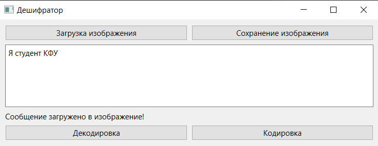
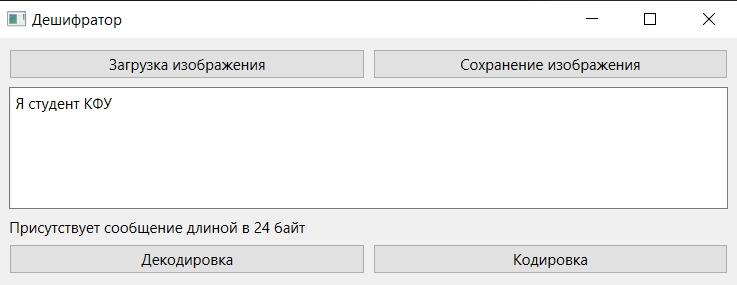

МИНИСТЕРСТВО НАУКИ  И ВЫСШЕГО ОБРАЗОВАНИЯ РОССИЙСКОЙ ФЕДЕРАЦИИ 
Федеральное государственное автономное образовательное учреждение высшего образования 
"КРЫМСКИЙ ФЕДЕРАЛЬНЫЙ УНИВЕРСИТЕТ им. В. И. ВЕРНАДСКОГО" 
ФИЗИКО-ТЕХНИЧЕСКИЙ ИНСТИТУТ 
Кафедра компьютерной инженерии и моделирования

 
<h3 align="center">Отчёт по лабораторной работе № 5  по дисциплине "Программирование"</h3>
  

студента 1 курса группы ПИ-б-о-202(1) 
Ясина Любомира Любомировича 
направления подготовки 09.03.04 "Программная инженерия"

  
<table>
<tr><td>Научный руководитель  старший преподаватель кафедры  компьютерной инженерии и моделирования</td>
<td>(оценка)</td>
<td>Тимофеева С. В.</td>
</tr>
</table>
  

Симферополь, 2021

## Цель:

1. Изучить базовые встроенные элементы фреймворка Qt предназначенные для создания приложений с графическим интерфейсом пользователя (GUI);
2. Изучить сигнально-слотовую систему, как один из способов организации взаимодействия компонентов GUI;
3. Получить практический навык работы с побитовыми операторами.

## Постановка задачи
1. Создать десктоп приложение с GUI позволяющее сохранять текстовую информацию в изображение формата png без видимого изменения исходного изображения. Приложение должно позволять сохранять текст в картинку и извлекать текст из картинки.

## Выполнение работы

## Задание 1

В ходе выполнения работы было создано десктоп приложение с GUI, используя фреймворк Qt. Приложение позволяет сохранять текст в изображение, а также извлекать ранее сохраненный текст без видимого изменения изображения. Алгоритм использования изображения выглядит следующим образом:
1. Загружаем изображение.
2. Вводим текст, или декодируем введенный ранее.
3. При изменении текста сохраняем изображение, тем самым подтвердив изменения.
На Рисунке 1 показано системное сообщение, подтвержающее успешное сохранение текста.

Рисунок 1 - сообщение об изменении текста

На рисунке 2 показано изображение в формате png, в котором зашифрован текст. 

Рисунок 2 - Зашифрованное изображение

На рисунке 3 показано декодирование изображения с выводом размера текста в системном сообщении. 

Рисунок 3 - Декодированый текст

Файлы с исполняемым кодом:

[[file-1]](./labrab5/main.cpp)  [[file-2]](./labrab5/mainwindow.cpp) [[file-3]](./labrab5/mainwindow.hpp)

После работы с приложением для выгрузки файлов на платформу Git, был обновлен догумент .gitignore, для обеспечения загрузки только необходимых файлов. 

## Вывод по работе. 
Для достижения поставленной цели были выполнены все поставленные задачи, а именно:

	1) Изучены базовые встроенные элементы фреймворка Qt предназначенные для создания приложений с графическим интерфейсом пользователя (GUI);
	2) Изучены сигнально-слотовую система, как один из способов организации взаимодействия компонентов GUI;
	3) Получен практический навык работы с побитовыми операторами.